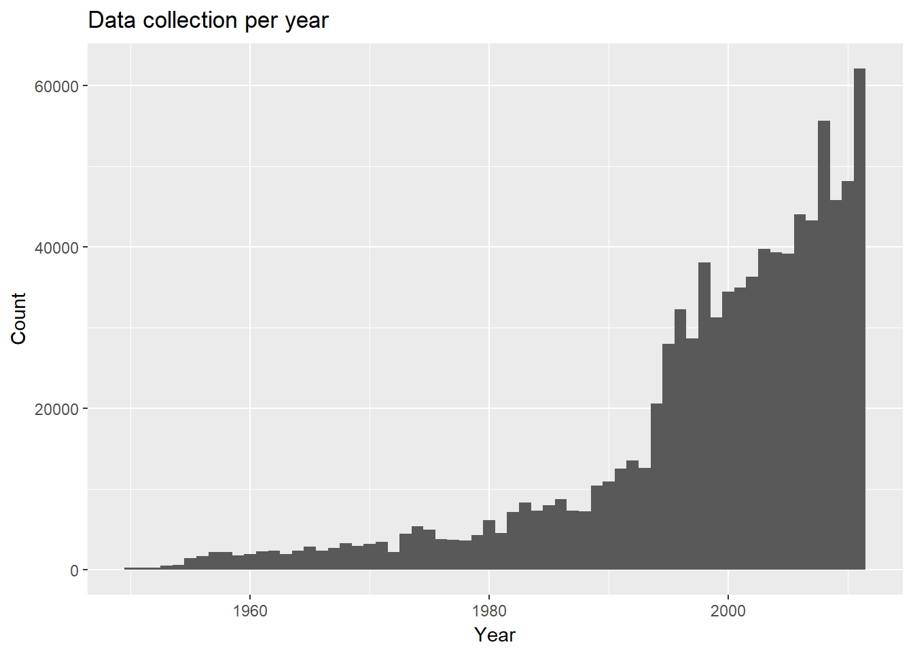
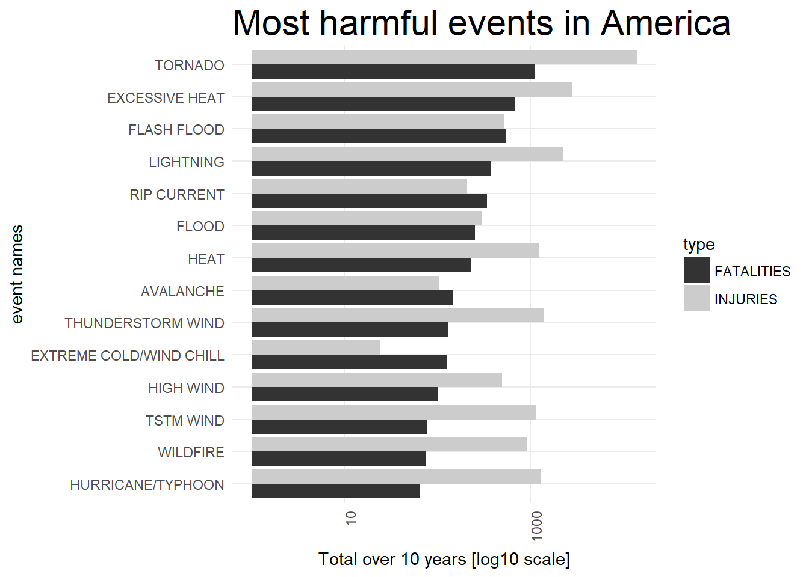
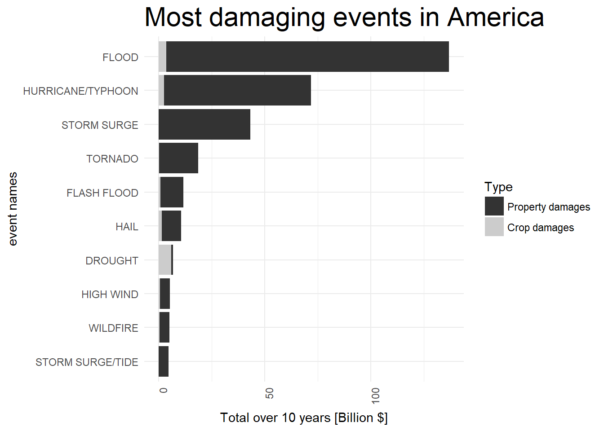

# Impact of meteo events in America


In this little study we will try to answer the two questions:
- Which types of meteo events are most harmful to population health in America?
- Which types of meteo events are most cause the most damage (in $) in America?
   

Storms and other severe weather events can cause both public health and economic problems for communities and municipalities. Many severe events can result in fatalities, injuries, and property damage, and preventing such outcomes to the extent possible is a key concern.

This project involves exploring the U.S. National Oceanic and Atmospheric Administration's (NOAA) storm database. This database tracks characteristics of major storms and weather events in the United States, including when and where they occur, as well as estimates of any fatalities, injuries, and property damage.

Extra documentation about this data base can be found on those links:

    * [data](https://d396qusza40orc.cloudfront.net/repdata%2Fdata%2FStormData.csv.bz2)
    * [code book](https://d396qusza40orc.cloudfront.net/repdata%2Fpeer2_doc%2Fpd01016005curr.pdf)
    * [FAQ](https://d396qusza40orc.cloudfront.net/repdata%2Fpeer2_doc%2FNCDC%20Storm%20Events-FAQ%20Page.pdf)

## Data processing
Basic data processing has been done: It mainly consists of subsetting a period, handling NA values and unit conversions.

```r
      library(dplyr)
      library(reshape2)
      library(ggplot2)

      storms_db <- read.csv("repdata%2Fdata%2FStormData.csv.bz2")  
      storms_db$BGN_DATE <- strptime(storms_db$BGN_DATE, "%m/%d/%Y %H:%M:%S") 
      
      qplot(storms_db$BGN_DATE$year+1900, 
            binwidth = 1, 
            main = "Data collection per year", 
            ylab = "Count", 
            xlab = "Year")
```


 
Data collection is much more complete in the last decade. We will choose to work with the 10 last years of this data set (2001-11-15 --> 2011-11-15).
  
  

```r
      library(dplyr)
      library(reshape2)

      last_10yrs <- storms_db$BGN_DATE > "2001-11-15 CET"
      selection <- c("EVTYPE","FATALITIES","INJURIES","PROPDMG","PROPDMGEXP","CROPDMG","CROPDMGEXP")
      events_db <- storms_db[last_10yrs,selection]
      
      
      # Cases of 0$ damages: set the *DMGEXP columns to 0 also avoid to NA after
            selection <- events_db$CROPDMG == 0
            events_db$CROPDMGEXP[selection] <- 0
            
            selection <- events_db$PROPDMG == 0
            events_db$PROPDMGEXP[selection] <- 0
      
      # Cases of the factor level in the *DMGEXP columns is not described in the code book: Set to NA
            events_db$PROPDMGEXP <- gsub("[^MmkKB0]","NAN",events_db$PROPDMGEXP)
            events_db$CROPDMGEXP <- gsub("[^MmkKB0]","NAN",events_db$CROPDMGEXP)
            
      # convert k (kilo), m(million) and b(billion) to numbers in the *DMGEXP columns
            events_db$PROPDMGEXP <- gsub("k|K","1000",events_db$PROPDMGEXP)
            events_db$PROPDMGEXP <- gsub("m|M","1000000",events_db$PROPDMGEXP)
            events_db$PROPDMGEXP <- gsub("b|B","1000000000",events_db$PROPDMGEXP)
            
            events_db$CROPDMGEXP <- gsub("k|K","1000",events_db$CROPDMGEXP)
            events_db$CROPDMGEXP <- gsub("m|M","1000000",events_db$CROPDMGEXP)
            events_db$CROPDMGEXP <- gsub("b|B","1000000000",events_db$CROPDMGEXP)

      # Conversion off all DMG columns into $ unit. creation of columns containing the total
            events_db$PROPDMG <- events_db$PROPDMG*as.numeric(events_db$PROPDMGEXP)
            events_db$CROPDMG <- events_db$CROPDMG*as.numeric(events_db$CROPDMGEXP)
            events_db$TOTDMG <- rowSums(events_db[,c("PROPDMG","CROPDMG")],na.rm = TRUE)
      
      # Selection and agregation of the relevant columns
            selection2 <- c("EVTYPE","FATALITIES","INJURIES","PROPDMG","CROPDMG","TOTDMG")
      events_sum <- events_db[,selection2]%>%
      group_by(EVTYPE)%>%
      summarise_each(funs(sum(.,na.rm=TRUE))) 
```


## Results
### Most Harmful events
We will define the "most harmfull" by simply counting the numbers of fatalities for each events over those 10 years.
Somehow, this approach combines dangerousity and frequency (at least in the data base) of each events.


```r
      library(ggplot2)
     
      # selection of the 10 most important events for injuries and fatalities --------------
      T10_fat <- head(events_sum[order(-events_sum$FATALITIES, - events_sum$INJURIES),],10)
      T10_inj <- head(events_sum[order(-events_sum$INJURIES, - events_sum$FATALITIES),],10)
      
      top_harmful <- union(T10_fat,T10_inj) 
      
      
      #plot ---------------------------------------------------------------------------------
      
      top_harmful$EVTYPE <- factor(top_harmful$EVTYPE,      
                                   levels = top_harmful$EVTYPE[order(-top_harmful$FATALITIES)])
      
      top_harmful_m <- melt(data = top_harmful[,c("EVTYPE","FATALITIES","INJURIES")],
                            id.vars = "EVTYPE", 
                            variable.name = "type",
                            value.name = "total")
      
      g <- ggplot(top_harmful_m,aes(EVTYPE, total, fill = type))
      
      g + geom_bar(stat = "identity", position="dodge")+
            theme_minimal()+ 
            theme(axis.text.x = element_text(angle = 90, hjust = 1),
                  plot.title = element_text(size=22))+ 
            scale_y_log10()+
            scale_fill_grey()+
            labs(title = "Most harmful events in America", x="event names", y = "Total [log10 scale]")
```



The most harmfull events in America are Tornado, Excessive heat and Flash flood.


### Most Harmful events

```r
      # selection of the 10 most damaging events--------------------------------------------
      T10_dmg <- head(events_sum[order(-events_sum$TOTDMG),],10)
      
      T10_dmg$EVTYPE <- factor( T10_dmg$EVTYPE,      
                                   levels =  T10_dmg$EVTYPE[order(- T10_dmg$TOTDMG)])
      
      T10_dmg_m <- melt(data= subset(T10_dmg,select=c("EVTYPE","PROPDMG","CROPDMG")),
                      id.vars = "EVTYPE",
                      variable.name = "type",
                      value.name = "total")
      
      #plot ---------------------------------------------------------------------------------
      p <- ggplot(T10_dmg_m,aes(EVTYPE, total/1000000000, fill = type))
      
      p+ geom_bar(stat = "identity", position="stack")+
            theme_minimal()+ 
            theme(axis.text.x = element_text(angle = 90, hjust = 1),plot.title = element_text(size=22))+ 
            scale_fill_grey()+
            labs(title = "Most damaging events in America", x="event names", y = "Total [Billion $]")
```



The most damaging events are floods, hurricans and storm surges.
